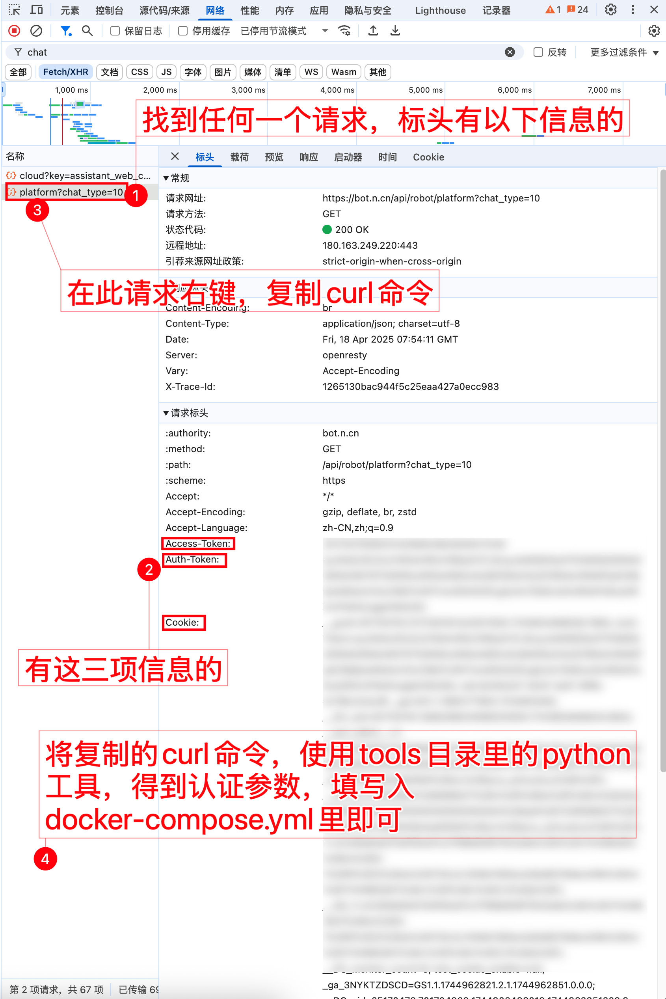

# 360Nami API 服务

<span>[ 中文 | <a href="README_EN.md">English</a> ]</span>

## 项目简介

本项目是一个 360Nami API 服务，提供与 360Nami 大模型的交互能力。支持高速流式输出、多轮对话、联网搜索、深度思考模式，同时支持自动删除对话历史，保护用户隐私。

与 ChatGPT 接口完全兼容，可以无缝集成到现有的基于 OpenAI API 的应用中。

## 功能特点

- **流式响应**: 支持高速流式输出，实时返回模型生成内容
- **多轮对话**: 支持完整的多轮对话能力
- **深度思考**: 支持 R1 深度思考和静默深度思考模式
- **联网搜索**: 支持联网搜索获取最新信息
- **思考内容**: 可以获取模型的推理过程 (reasoning_content)
- **自动清理**: 每次对话结束后自动删除对话历史
- **OpenAI 兼容**: 与 ChatGPT API 格式完全兼容

## 接入准备

请确保您在中国境内或者拥有中国境内的个人计算设备，否则部署后可能因无法访问 360Nami 而无法使用。

从 [360Nami](https://bot.n.cn/) 获取认证参数:

进入 360Nami 随便发起一个对话，然后 F12 打开开发者工具，从"网络"中找到“标头”带有“Access-Token”、“Auth-Token”、“Cookie” 值的任意一个请求，右键点击“复制curl命令”，将复制的curl字符串，使用tools目录里的python工具，得到认证参数，填写到docker-compose.yml里即可。(也可以手工复制拼接字符串，但易错，不推荐)



### 多账号接入

目前同个账号同时只能有*一路*输出，你可以通过提供多个账号的 认证参数 并使用`,`拼接提供：

```json
NAMI_AUTH_LIST=[
          {
            "COOKIE": "",
            "ACCESS_TOKEN": "",
            "AUTH_TOKEN": ""
          },
          {
            "COOKIE": "",
            "ACCESS_TOKEN": "",
            "AUTH_TOKEN": ""
          },
          {
            "COOKIE": "",
            "ACCESS_TOKEN": "",
            "AUTH_TOKEN": ""
          }
        ]
```

每次请求服务会从中轮询选择一个。

### 环境变量配置

| 环境变量 | 是否必填 | 说明                               |
|------|------|----------------------------------|
| NAMI_AUTH_LIST | 是 | 作为360nami的认证信息，可以是多个账户的 |

## 部署方法

### Docker 部署

拉取镜像并启动服务。

```shell
# 必须将配置在环境变量
docker run -it -d --init --name 360nami-api -p 8000:8000 -e TZ=Asia/Shanghai -e NAMI_AUTH_LIST=xxx your-docker-image:latest
```

### 原生部署

请先安装好 Node.js 环境并且配置好环境变量，确认 node 命令可用。

安装依赖：

```shell
npm i
```

编译构建：

```shell
npm run build
```

启动服务：

```shell
npm start
```


## API 接口文档

### 对话补全接口

对话补全接口，与 OpenAI 的 [chat-completions-api](https://platform.openai.com/docs/guides/text-generation/chat-completions-api) 兼容。

**POST /v1/chat/completions**

header 需要设置 Authorization 头部：

```
Authorization: Bearer [任意值]
```

请求数据：
```json
{
    // model名称
    // 默认：deepseek
    // 深度思考：deepseek-think 或 deepseek-r1
    // 联网搜索：deepseek-search
    // 深度思考+联网搜索：deepseek-r1-search 或 deepseek-think-search
    // 静默模式（不输出思考过程或联网搜索结果）：deepseek-think-silent 或 deepseek-r1-silent 或 deepseek-search-silent
    // 深度思考但思考过程使用<details>可折叠标签包裹（需要页面支持显示）：deepseek-think-fold 或 deepseek-r1-fold
    "model": "deepseek",
    "messages": [
        {
            "role": "user",
            "content": "你是谁？"
        }
    ],
    // 如果使用流式响应请设置为true，默认false
    "stream": false
}
```

响应数据：
```json
{
    "id": "50207e56-747e-4800-9068-c6fd618374ee@2",
    "model": "deepseek",
    "object": "chat.completion",
    "choices": [
        {
            "index": 0,
            "message": {
                "role": "assistant",
                "content": " 我是DeepSeek Chat，一个由深度求索公司开发的智能助手，旨在通过自然语言处理和机器学习技术来提供信息查询、对话交流和解答问题等服务。",
                "reasoning_content": "这里是思考模式下的推理内容" // 仅在思考模式下返回
            },
            "finish_reason": "stop"
        }
    ],
    "usage": {
        "prompt_tokens": 1,
        "completion_tokens": 1,
        "total_tokens": 2
    },
    "created": 1715061432,
    "conversation_id": "50207e56-747e-4800-9068-c6fd618374ee" // 对话ID
}
```

### 特殊功能参数说明

#### 深度思考模式

使用 `deepseek-think` 或 `deepseek-r1` 作为 model 参数，可以启用深度思考模式。在这种模式下，模型会先进行思考，然后再给出答案。思考内容会被包含在 `reasoning_content` 字段中返回。

```json
{
    "model": "deepseek-think",
    "messages": [
        {
            "role": "user",
            "content": "用数学方法解决这个问题：一个商店有三种水果，苹果、香蕉和橙子。如果我买了2个苹果、3个香蕉和1个橙子，总共花了12元；如果我买了3个苹果、2个香蕉和2个橙子，总共花了15元；如果我买了1个苹果、1个香蕉和3个橙子，总共花了12元。那么每种水果的单价是多少？"
        }
    ]
}
```

#### 联网搜索

使用 `deepseek-search` 作为 model 参数，可以启用联网搜索功能。

```json
{
    "model": "deepseek-search",
    "messages": [
        {
            "role": "user",
            "content": "最近的奥运会情况如何？"
        }
    ]
}
```

#### 模型列表

请求/models可以获得所有支持模型列表，目前共有**47种**。将你想使用的32位模型id，按以下格式填入下方[模型id]处，即可使用指定模型。

```json
{
    "model": "[模型id]-chat",
    "messages": [
        {
            "role": "user",
            "content": "最近的奥运会情况如何？"
        }
    ]
}
```

## 注意事项

### Nginx 反代优化

如果您正在使用 Nginx 反向代理本项目，请添加以下配置项优化流的输出效果：

```nginx
# 关闭代理缓冲
proxy_buffering off;
# 启用分块传输编码
chunked_transfer_encoding on;
# 开启TCP_NOPUSH
tcp_nopush on;
# 开启TCP_NODELAY
tcp_nodelay on;
# 设置保持连接的超时时间
keepalive_timeout 120;
```

### 免责声明

本项目仅供学习和研究使用，请勿用于商业用途。使用本项目时请遵守相关法律法规和服务条款。
