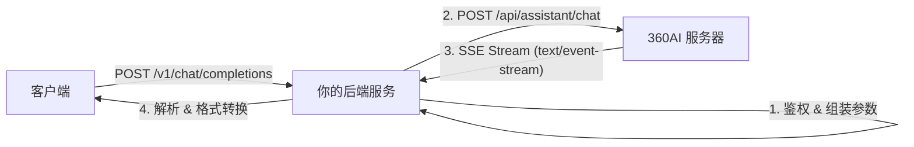

# 程序执行流程汇总

本项目作为一个代理网关，将客户端的标准 OpenAI 格式请求转换为 360AI 的私有协议请求，并将响应流实时转换回 OpenAI 格式。

## 1. 整体链路流程



## 2. 核心关注：后端访问 360AI 的细节

后端代理请求主要发生在 `src/api/controllers/360ai/completions.ts` 文件中。

### 2.1 访问的 API 端点

*   **URL:** `https://bot.n.cn/api/assistant/chat`
*   **Method:** `POST`
*   **Response Type:** Stream (流式响应)

### 2.2 请求头 (Headers)

请求头包含静态伪装头、身份凭证和动态计算的加密头。

| Header 字段 | 说明 | 来源/生成逻辑 |
| :--- | :--- | :--- |
| `Cookie` | 核心凭证 | `auth.COOKIE` (从配置或自动获取) |
| `sid` | Session ID | `auth.ACCESS_TOKEN` |
| `auth-token` | 认证 Token | `auth.AUTH_TOKEN` |
| `zm-ua` | 动态生成的 User-Agent 哈希 | `md5(USER_AGENT)` (在 `auth.ts` 中生成) |
| `zm-token` | **动态加密 Token (关键)** | `md5('Web' + timestamp + '1.2' + accessToken + zmUa)` |
| `user-agent` | 伪装的浏览器 UA | `Mozilla/5.0 ...` (定义在 `constants.ts`) |
| `content-type` | 内容类型 | `application/json` |
| `accept` | 接收类型 | `text/event-stream` |
| `referer` | 来源页面 | `https://bot.n.cn/chat/...` |
| `origin` | 请求源 | `https://bot.n.cn` |

> **注意**: `zm-token` 是通过 `src/api/controllers/360ai/auth.ts` 中的 `generateAuthHeaders` 函数动态生成的，依赖于当前时间戳和 `accessToken`。

### 2.3 请求参数 (Body Payload)

发送给 360AI 的 JSON 数据包，核心字段如下：

```json
{
  "role": "...",              // 角色ID，默认在 constants.ts 中定义 (如 "a0c817f8...")
  "prompt": "...",            // 经过处理的用户输入内容 (messageUtils.ts 处理)
  "re_answer": 0,             // 是否重答
  "retry": false,             // 是否重试
  "last_id": 0,               // 上一条消息ID
  "compare_parent_id": "",    
  "role_biz": "",
  "firm_id": "",
  "rewrite_type": "",
  "annex_msg_id": "",
  "kwargs": {
    "think_stream": true      // 开启思考过程流 (对于深度思考模型)
  },
  "is_so": false,             // 是否开启联网搜索 (根据模型名判断，如含 "search")
  "role_mode": 1              // 模式：0=思考模式, 1=非思考模式 (根据模型名判断，如含 "think"/"r1")
}
```

## 3. 响应处理流程

360AI 返回的是 SSE (Server-Sent Events) 流，后端通过 `src/api/controllers/360ai/streamHandlers.ts` 进行解析：

1.  **事件监听**: 使用 `eventsource-parser` 解析流数据。
2.  **事件类型识别**:
    *   `event: 100` -> 提取 **Conversation ID** (会话ID)
    *   `event: 101` -> 提取 **Message ID** (消息ID)
    *   `event: 200` -> 提取 **普通文本内容**
    *   `event: 2001` -> 提取 **思考过程内容** (Thinking Process)
    *   `event: 2002` -> 提取 **搜索来源内容** (Search Results)
3.  **格式转换**: 将上述私有格式实时转换为 OpenAI 兼容的 JSON 格式（包含 `choices`, `delta`, `usage` 等字段）推送到客户端。

## 4. 代码文件映射

*   **入口路由**: `src/api/routes/chat.ts`
*   **主控制器 (发起请求)**: `src/api/controllers/360ai/completions.ts`
*   **鉴权头生成 (zm-token)**: `src/api/controllers/360ai/auth.ts`
*   **流解析 (SSE处理)**: `src/api/controllers/360ai/streamHandlers.ts`
*   **常量配置 (URL/UA)**: `src/api/controllers/360ai/constants.ts`
